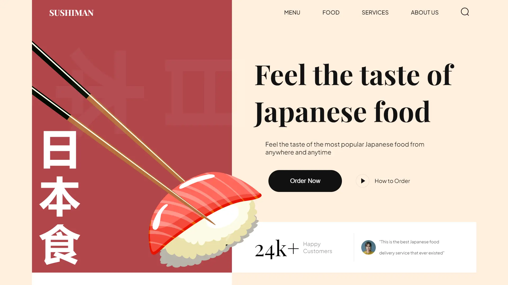

<div align="center">
    <a href="https://sushi-1-fv.netlify.app" target="_blank">
      
    </a>
  <h3 align="center">Sushi Restaurant</h3>
</div>

##  <br /> 📋 <a name="table">Table of Contents</a>

- ✨ [Introduction](#introduction)
- ⚙️ [Tech Stack](#tech-stack)
- 📝 [Features](#features)
- 🚀 [Quick Start](#quick-start)

##  <br /> <a name="introduction">✨ Introduction</a>

**[EN]** Landing page design for a sushi restaurant featuring a modern and minimalist aesthetic, crafted using HTML, CSS, and JavaScript. It showcases popular food, trending sushi, and drinks with smooth subtle animations.

**[FR]** Page d'accueil pour un restaurant de sushi, présentant une esthétique moderne et minimaliste, réalisée en HTML, CSS et JavaScript. Elle met en avant des plats populaires, des sushis tendance et des boissons, avec des animations douces et subtiles.

##  <br /> <a name="tech-stack">⚙️ Tech Stack</a>

- HTML
- CSS
- JavaScript
- Vite


## <br/> <a name="features">📝 Features</a>

👉 **CSS Variables**: Utilize CSS variables to maintain a consistent and easily adjustable styling approach throughout the project

👉 **Importing CSS Files**: Import CSS files into others, promoting modularity and organization in styling.

👉 **Flex and Position Properties**: Use of flex and position properties in CSS to create responsive and well-structured layouts.

👉 **Rendering HTML through JavaScript**: Rendering HTML through JavaScript using reusable functions, enhancing code efficiency.

👉 **Smooth Animations**: Smooth and subtle animations to enhance the overall user experience, focusing on fluid transitions.

👉 **BEM Method**: Follow the Block Element Modifier (BEM) methodology for naming classes, promoting a clear and maintainable structure.

👉 **Organized File and Folder Structure**: Maintain a well-organized file and folder structure for easy navigation and management of project assets.

👉 **Responsive Design**: The application is completely responsive across all devices, employing responsive design techniques such as media queries and fluid layouts.

## <br /> <a name="quick-start">🚀 Quick Start</a>

Follow these steps to set up the project locally on your machine.

<br/>**Prerequisites**

Make sure you have the following installed on your machine:

- [Git](https://git-scm.com/)
- [Node.js](https://nodejs.org/en)
- [npm](https://www.npmjs.com/) (Node Package Manager)

<br/>**Cloning the Repository**

```bash
git clone {git remote URL}
```

<br/>**Installation**

Let's install the project dependencies, from your terminal, run:

```bash
npm install
# or
yarn install
```

<br/>**Running the Project**

Installation will take a minute or two, but once that's done, you should be able to run the following command:

```bash
npm run dev
# or
yarn dev
```

Open [`http://localhost:3000`](http://localhost:3000) in your browser to view the project.